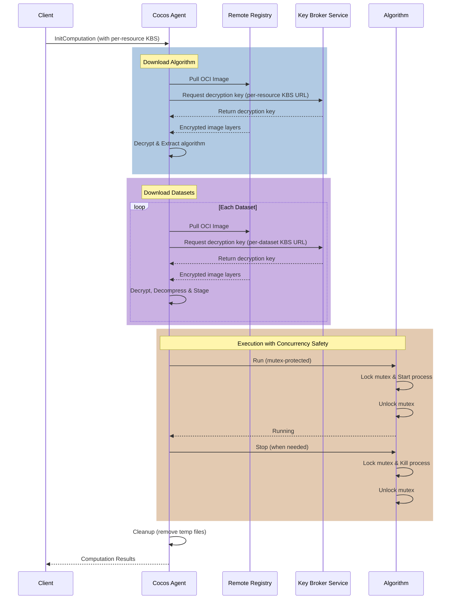

Remote resources allow Cocos to securely download and execute algorithms and datasets packaged as OCI (Open Container Initiative) images directly from container registries. This mechanism integrates with the Confidential Containers (CoCo) ecosystem to ensure that resources remain encrypted until they are safely inside a Trusted Execution Environment (TEE).

## Architecture Overview

The remote resource handling in Cocos leverages several standard components:

1. **Skopeo**: Used to download and manage OCI images.
2. **ocicrypt**: Provides the encryption/decryption layer for OCI images.
3. **CoCo Key Provider**: A gRPC service that acts as a bridge between `ocicrypt` and the Attestation Agent.
4. **Attestation Agent**: Generates TEE evidence (attestation) required to fetch decryption keys.
5. **Key Broker Service (KBS)**: Stores decryption keys and only releases them upon successful verification of TEE evidence.

### Workflow

The following diagram illustrates the lifecycle of a remote resource computation, including per-resource KBS resolution and secure execution.



1. **Encryption**: Algorithms and datasets are packaged as OCI images and encrypted using `skopeo` and `ocicrypt`. The encryption keys are stored in a KBS.
2. **Manifest**: A computation manifest is sent to the Cocos Agent, specifying the URIs of the encrypted OCI images and their corresponding KBS resource paths/URLs.
3. **Download**: The Agent invokes `skopeo` to download the encrypted layers.
4. **Decryption**: `skopeo` (via `ocicrypt`) requests the decryption key from the `coco-keyprovider`, which fetches it from the specified KBS.
5. **Attestation**: The `coco-keyprovider` works with the `attestation-agent` to provide evidence to the KBS for key release.
6. **Execution**: Once decrypted, the algorithm and datasets are extracted and executed within the secure enclave.

## Computation Manifest Format

To use remote resources, the computation manifest must specify the source type as `oci-image` and include the encryption details.

```json
{
  "computation_id": "example-computation",
  "algorithm": {
    "type": "oci-image",
    "uri": "docker://registry.example.com/encrypted-algo:latest",
    "encrypted": true,
    "kbs_resource_path": "default/key/algo-key"
  },
  "datasets": [
    {
      "type": "oci-image",
      "uri": "docker://registry.example.com/encrypted-dataset:latest",
      "encrypted": true,
      "kbs_resource_path": "default/key/dataset-key"
    }
  ],
  "kbs_url": "http://kbs.example.com:8080"
}
```

## Creating Encrypted Resources

### 1. Package and Encrypt an Algorithm

First, build your algorithm as a Docker image and push it to a registry. Then, use `skopeo` with a CoCo-compatible key provider to encrypt it.

```bash
# Encrypt an OCI image
skopeo copy \
  --encryption-key "provider:attestation-agent:keypath=/path/to/local.key::keyid=kbs:///default/key/algo-key::algorithm=A256GCM" \
  docker://registry.example.com/plain-algo:latest \
  docker://registry.example.com/encrypted-algo:latest
```

### 2. Store the Key in KBS

Ensure the decryption key used during encryption is stored in your KBS at the specified path (`default/key/algo-key`).

## Running a Computation

When starting a computation through a CVMS (Computation Management Server), you must provide the remote resource URIs and KBS configuration.

### Using `cvms-test`

If you are using the `cvms-test` server for testing, you can specify remote resources using the following flags:

```bash
./build/cvms-test \
  -kbs-url http://<KBS_IP>:8080 \
  -algo-type python \
  -algo-source-url docker://<REGISTRY_IP>:5000/encrypted-algo:v1.0 \
  -algo-kbs-path default/key/algo-key \
  -dataset-source-urls docker://<REGISTRY_IP>:5000/encrypted-dataset:v1.0 \
  -dataset-kbs-paths default/key/dataset-key
```

## Benefits of Remote Resources

- **Standards-Based**: Leverages OCI and CoCo standards for container security.
- **Enhanced Security**: Resources are never decrypted outside of the TEE.
- **Scalability**: Works seamlessly with any OCI-compliant registry (GitHub Container Registry, Docker Hub, private registries).
- **Interoperability**: Compatible with the broader Confidential Containers ecosystem.
