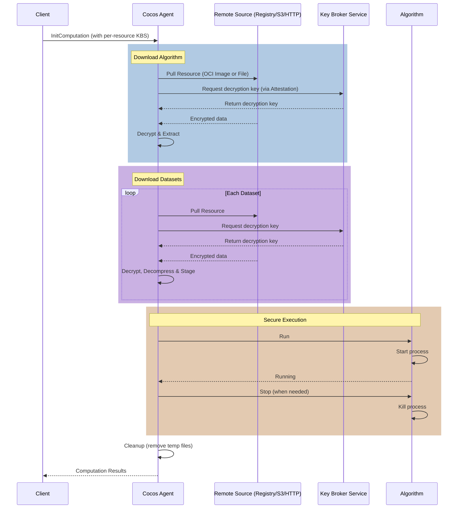

Remote resources allow Cocos to securely download and execute algorithms and datasets directly from remote storage into a Trusted Execution Environment (TEE). Cocos supports standard OCI (Open Container Initiative) images from container registries, as well as generic files hosted on S3-compatible storage, Google Cloud Storage (GCS), or HTTP(S) web servers.

## Architecture Overview

The remote resource handling in Cocos uses different mechanisms depending on the source type:

### OCI Images
1. **Skopeo**: Used to download and manage OCI images.
2. **ocicrypt**: Provides the encryption/decryption layer for OCI images.
3. **CoCo Key Provider**: A gRPC service that acts as a bridge between `ocicrypt` and the Attestation Agent.

### Non-OCI Sources (S3, GCS, HTTP/S)
1. **Built-in Downloaders**: Directly fetch the encrypted payloads.
2. **Standard AES-256-GCM**: The Agent handles decryption natively using standard AES-GCM.

### Shared Components
1. **Attestation Agent**: Generates TEE evidence (attestation) required to fetch decryption keys.
2. **Key Broker Service (KBS)**: Stores decryption keys and only releases them upon successful verification of TEE evidence.

### Workflow

The following diagram illustrates the lifecycle of a remote resource computation.



1. **Manifest**: A computation manifest is sent to the Cocos Agent, specifying the URIs of the encrypted resources and their corresponding KBS resource paths.
2. **Download**: The Agent downloads the encrypted data (via `skopeo` for OCI, or internal downloaders for S3/HTTP).
3. **Decryption**: The system requests the decryption key, which is fetched from the specified KBS after providing evidence from the `attestation-agent`.
4. **Execution**: Once decrypted, the algorithm and datasets are extracted and executed within the secure enclave.

## Computation Manifest Format

The computation manifest specifies the source type and includes the encryption details. If `type` is omitted, it will automatically be inferred from the URL scheme.

### OCI Image Example
```json
{
  "computation_id": "example-computation",
  "algorithm": {
    "type": "oci-image",
    "uri": "docker://registry.example.com/encrypted-algo:latest",
    "encrypted": true,
    "kbs_resource_path": "default/key/algo-key"
  }
}
```

### S3 / HTTP Example
```json
{
  "computation_id": "example-computation",
  "algorithm": {
    "type": "s3",
    "uri": "s3://my-secure-bucket/algo.enc",
    "encrypted": true,
    "kbs_resource_path": "default/key/algo-key"
  }
}
```
Supported `type` values: `oci-image`, `s3`, `gcs`, `https`, `http`.

## Creating Encrypted Resources

### 1a. Package and Encrypt an OCI Algorithm

Build your algorithm as a Docker image and push it to a registry. Then, use `skopeo` with a CoCo-compatible key provider to encrypt it.

```bash
# Encrypt an OCI image
skopeo copy \
  --encryption-key "provider:attestation-agent:keypath=/path/to/local.key::keyid=kbs:///default/key/algo-key::algorithm=A256GCM" \
  docker://registry.example.com/plain-algo:latest \
  docker://registry.example.com/encrypted-algo:latest
```

### 1b. Encrypt Non-OCI Sources (S3, HTTP)

Unlike OCI images where `ocicrypt` wraps the dataset, resources hosted on HTTP/S3 must be straightforwardly encrypted using **AES-256-GCM**.

The expected format is exactly as produced by standard Go AES-GCM:
`nonce (12 bytes) || ciphertext || tag`

Upload the resulting encrypted file to your S3 bucket or web server.

### 2. Store the Key in KBS

Ensure the decryption key used during encryption is stored in your KBS at the specified path (`default/key/algo-key`).

## Running a Computation

When starting a computation through a CVMS (Computation Management Server), you must provide the remote resource URIs and KBS configuration.

### Using `cvms-test`

If you are using the `cvms-test` server for testing, you can specify remote resources using the corresponding flags.

**Testing OCI Images:**
```bash
./build/cvms-test \
  -kbs-url http://<KBS_IP>:8080 \
  -algo-type python \
  -algo-source-url docker://<REGISTRY_IP>:5000/encrypted-algo:v1.0 \
  -algo-kbs-path default/key/algo-key
```

**Testing S3/HTTP Resources:**
```bash
./build/cvms-test \
  -kbs-url http://<KBS_IP>:8080 \
  -algo-type python \
  -algo-source-url "s3://my-secure-bucket/script.enc" \
  -algo-source-type "s3" \
  -algo-kbs-path "default/key/script-key"
```

## Benefits of Remote Resources

- **Flexibility**: Support for both standard OCI registries and traditional object storage/web servers.
- **Standards-Based**: Leverages OCI and CoCo standards for container security.
- **Enhanced Security**: Resources are never decrypted outside of the TEE.
- **Interoperability**: Compatible with the broader Confidential Containers ecosystem.
