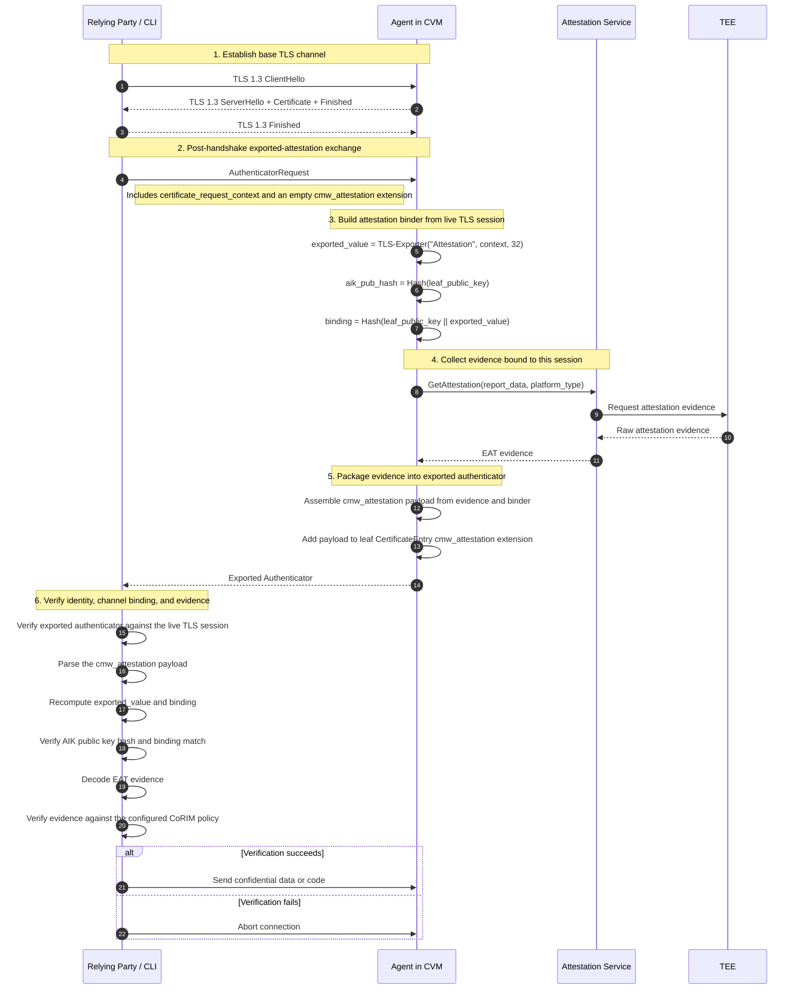

For a relying party to send confidential data or code to the Agent, a secure channel must be established between them. In Cocos, this is achieved through **Attested TLS (aTLS)**: a standard TLS 1.3 connection combined with an **Exported Authenticator (EA)** handshake that is cryptographically bound to the specific TLS session.

## Overview

Unlike traditional TLS, which typically validates the server's identity based on a certificate signed by a trusted CA, aTLS allows the client (relying party) to verify the **hardware-backed integrity** of the server (the Agent running in a TEE).

The core of Cocos aTLS is **Level 2 session binding**. This means the attestation evidence is not just tied to the server's long-lived or ephemeral certificate, but to the **live TLS session** itself. This prevents "attestation relay" or "man-in-the-middle" attacks where a malicious actor might try to present a valid attestation from a trusted TEE for an untrusted connection.

## The aTLS Handshake

The aTLS process happens in two main phases: the standard TLS handshake and the subsequent Exported Authenticator exchange.



### 1. TLS 1.3 Handshake

The CLI and Agent first establish a standard TLS 1.3 channel. The Agent acts as the server. This channel provides encryption and ensures that subsequent messages are protected.

### 2. Authenticator Request

Once the TLS session is established, the CLI sends an `AuthenticatorRequest`. This request includes a **Context** (derived from a nonce) that ensures the absolute freshness of the attestation response. This replaces the older SNI-based nonce mechanism.

```go
return &ea.AuthenticatorRequest{
    Type:    ea.HandshakeTypeClientCertificateRequest,
    Context: context,
    Extensions: []ea.Extension{
        sigExt,
        ea.CMWAttestationOfferExtension(),
    },
}, nil
```

### 3. Session Binding (Level 2)

Cocos uses **TLS 1.3 Exporters** to cryptographically bind the attestation statement to the connection. Using the `ExportKeyingMaterial` function with the label `"Attestation"`, both parties derive a session-unique value.

The binding is computed using:

- The **TLS Exporter output** (unique to the session).
- The **Leaf Public Key** of the Agent.
- The **Certificate Request Context** (ensuring freshness).

```go
// Exporter and Binding derivation
exportedValue, h, err := ExportAttestationValue(st, LabelAttestation, context)
aikPubHash = AIKPublicKeyHash(h, leafPubKey)
binding = BindingValue(h, leafPubKey, exportedValue)
```

### 4. Evidence Generation and Verification

The Agent passes the derived **Binding** value as the `REPORT_DATA` (or equivalent) to the TEE hardware. The hardware generates a signed evidence report containing this binding.

The CLI receives the `Authenticator` message, extracts the attestation payload, and:

1. Recomputes the binding from its own view of the TLS session.
2. Verifies that the hardware evidence matches the recomputed binding.
3. Appraises the TEE claims against the configured security policy.

## Security Hardening (CVE GHSA-vfgg-mvxx-mgg7)

Prior to the implementation of explicit session binding, some aTLS implementations were vulnerable to **Unbound Attestation** (similar to CVE GHSA-vfgg-mvxx-mgg7). In such scenarios, if attestation was only bound to the certificate, a compromised or malicious TEE could potentially "forward" its attestation to a different TLS session.

Cocos mitigates this by enforcing **Level 2 Binding**, where the attestation is verified against the unique shared master secret of the TLS 1.3 session via exporters. This ensures that the peer you are talking to in the TLS session is the *exact same* entity that the TEE hardware is attesting to.

## Attestation Payload Structure

The attestation evidence and binder metadata are packaged into a `cmw_attestation` extension (type `0xFF00`) within the first entry of the authenticator's certificate chain.

```go
payloadBytes, err := eaattestation.MarshalPayload(eaattestation.Payload{
    Version:   1,
    MediaType: "application/eat+cwt",
    Evidence:  evidence,
    Binder: eaattestation.AttestationBinder{
        ExporterLabel: eaattestation.ExporterLabelAttestation, // "Attestation"
        AIKPubHash:    aikPubHash,
        Binding:       binding,
    },
})
```

If a server CA bundle is configured, the CLI also performs normal X.509 certificate validation. If no CA bundle is configured, the server identity may be self-signed or ephemeral and trust is established primarily through the attestation evidence and the TLS-session binding.

In Cocos terminology, aTLS can also be combined with mutual TLS. In that configuration, the client certificate is still required and verified, while the server additionally proves its TEE state through the attestation-bound authenticator.
